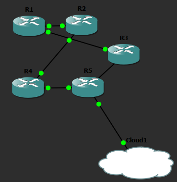
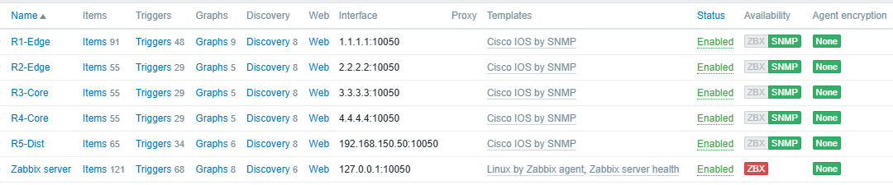
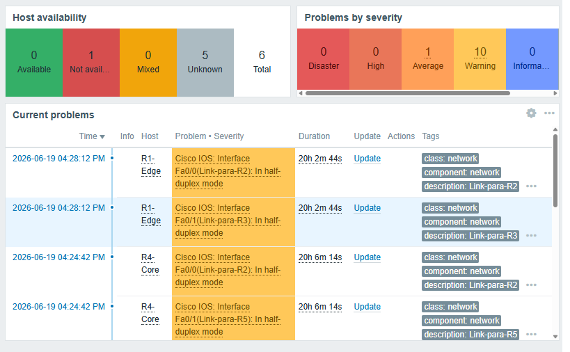
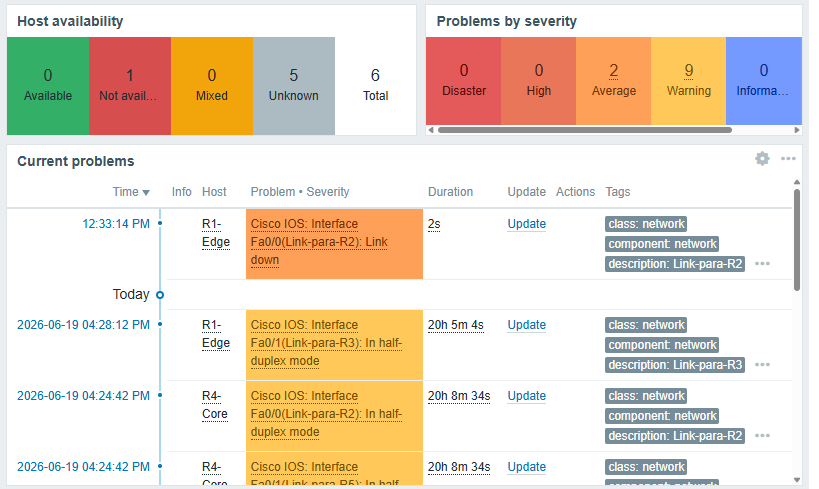

# ISP Lab — BGP Multi-Homed + OSPF + Monitoramento Zabbix

Lab de simulação de rede ISP com roteamento BGP multi-homed, OSPF interno e monitoramento via Zabbix. Construído no GNS3 com roteadores Cisco c3725 (Dynamips) e Zabbix rodando via Docker na máquina host.

---

## Topologia

```
        [ISP-A]              [ISP-B]
        AS 65001             AS 65002
           |                    |
        eBGP                 eBGP
           |                    |
      [R1-Edge]  ---iBGP--- [R2-Edge]
      AS 65000               AS 65000
      Lo: 1.1.1.1            Lo: 2.2.2.2
           |                    |
      [R3-Core]            [R4-Core]
      Lo: 3.3.3.3            Lo: 4.4.4.4
           \                  /
            \                /
            [R5-Dist]-----[Cloud]
            Lo: 5.5.5.5       |
                           [Zabbix]
                           (Docker)
```


*Topologia completa rodando no GNS3: os 5 roteadores, o Cloud node conectado ao R5-Dist, e todas as adjacências OSPF/iBGP estabelecidas.*

---

## Endereçamento

| Link | Rede | R1 | R2 |
|------|------|----|----|
| R1 ↔ R2 | 10.0.12.0/30 | 10.0.12.1 | 10.0.12.2 |
| R1 ↔ R3 | 10.0.13.0/30 | 10.0.13.1 | — |
| R3 lado | — | — | 10.0.13.2 |
| R2 ↔ R4 | 10.0.24.0/30 | 10.0.24.1 | — |
| R4 lado | — | — | 10.0.24.2 |
| R3 ↔ R5 | 10.0.35.0/30 | 10.0.35.1 | — |
| R5 lado | — | — | 10.0.35.2 |
| R4 ↔ R5 | 10.0.45.0/30 | 10.0.45.1 | — |
| R5 lado | — | — | 10.0.45.2 |

| Roteador | Loopback |
|----------|----------|
| R1-Edge | 1.1.1.1/32 |
| R2-Edge | 2.2.2.2/32 |
| R3-Core | 3.3.3.3/32 |
| R4-Core | 4.4.4.4/32 |
| R5-Dist | 5.5.5.5/32 |

---

## Ambiente

- **GNS3** rodando direto no Windows (sem GNS3 VM) com Dynamips
- **Imagem IOS:** c3725-adventerprisek9-mz.124-15.T14
- **Módulos por roteador:** NM-1FE-TX nos slots 1 e 2 (4 interfaces FastEthernet + 4 Serial)
- **Zabbix:** Docker Compose na máquina host (fora do GNS3)
- **Conectividade GNS3 ↔ Zabbix:** Cloud node conectado ao R5-Dist

---

## Status atual

- [x] Topologia cabeada e interfaces UP
- [x] OSPF configurado em todos os roteadores (área 0)
- [x] Adjacências OSPF estabelecidas (FULL)
- [x] iBGP configurado entre R1-Edge e R2-Edge
- [x] Sessão BGP estabelecida (Established, PfxRcd: 3)
- [x] Teste de resiliência: shutdown F0/0 do R1 → OSPF reconvergiu em <2s, BGP manteve sessão via caminho alternativo
- [x] Cloud node configurado no GNS3 (via VMnet8, com rotas estáticas até o host)
- [x] Zabbix: hosts cadastrados (5 roteadores, template "Cisco IOS by SNMP")
- [x] Zabbix: templates SNMP aplicados, discovery de interfaces funcionando
- [x] Teste de queda com alerta no dashboard Zabbix (R1-Edge, Fa0/0)
- [ ] Replicar correção de macro `{$NET.IF.IFADMINSTATUS.NOT_MATCHES}` nos outros 4 hosts
- [ ] Capturar prints finais (topologia GNS3, dashboard verde, dashboard com alerta)
- [ ] README final com prints (este arquivo, versão de portfólio)

---

## Configurações

### R1-Edge

```
hostname R1-Edge
no ip domain-lookup
!
interface FastEthernet0/0
 description Link-para-R2
 ip address 10.0.12.1 255.255.255.252
 no shutdown
!
interface FastEthernet0/1
 description Link-para-R3
 ip address 10.0.13.1 255.255.255.252
 no shutdown
!
interface Loopback0
 ip address 1.1.1.1 255.255.255.255
!
router ospf 1
 router-id 1.1.1.1
 network 10.0.12.0 0.0.0.3 area 0
 network 10.0.13.0 0.0.0.3 area 0
 network 1.1.1.1 0.0.0.0 area 0
 passive-interface Loopback0
!
router bgp 65000
 bgp router-id 1.1.1.1
 bgp log-neighbor-changes
 neighbor 2.2.2.2 remote-as 65000
 neighbor 2.2.2.2 update-source Loopback0
 neighbor 2.2.2.2 next-hop-self
 network 1.1.1.1 mask 255.255.255.255
 network 10.0.12.0 mask 255.255.255.252
 network 10.0.13.0 mask 255.255.255.252
```

### R2-Edge

```
hostname R2-Edge
no ip domain-lookup
!
interface FastEthernet0/0
 description Link-para-R1
 ip address 10.0.12.2 255.255.255.252
 no shutdown
!
interface FastEthernet0/1
 description Link-para-R4
 ip address 10.0.24.1 255.255.255.252
 no shutdown
!
interface Loopback0
 ip address 2.2.2.2 255.255.255.255
!
router ospf 1
 router-id 2.2.2.2
 network 10.0.12.0 0.0.0.3 area 0
 network 10.0.24.0 0.0.0.3 area 0
 network 2.2.2.2 0.0.0.0 area 0
 passive-interface Loopback0
!
router bgp 65000
 bgp router-id 2.2.2.2
 bgp log-neighbor-changes
 neighbor 1.1.1.1 remote-as 65000
 neighbor 1.1.1.1 update-source Loopback0
 neighbor 1.1.1.1 next-hop-self
 network 2.2.2.2 mask 255.255.255.255
 network 10.0.12.0 mask 255.255.255.252
 network 10.0.24.0 mask 255.255.255.252
```

### R3-Core

```
hostname R3-Core
no ip domain-lookup
!
interface FastEthernet0/0
 description Link-para-R1
 ip address 10.0.13.2 255.255.255.252
 no shutdown
!
interface FastEthernet0/1
 description Link-para-R5
 ip address 10.0.35.1 255.255.255.252
 no shutdown
!
interface Loopback0
 ip address 3.3.3.3 255.255.255.255
!
router ospf 1
 router-id 3.3.3.3
 network 10.0.13.0 0.0.0.3 area 0
 network 10.0.35.0 0.0.0.3 area 0
 network 3.3.3.3 0.0.0.0 area 0
 passive-interface Loopback0
```

### R4-Core

```
hostname R4-Core
no ip domain-lookup
!
interface FastEthernet0/0
 description Link-para-R2
 ip address 10.0.24.2 255.255.255.252
 no shutdown
!
interface FastEthernet0/1
 description Link-para-R5
 ip address 10.0.45.1 255.255.255.252
 no shutdown
!
interface Loopback0
 ip address 4.4.4.4 255.255.255.255
!
router ospf 1
 router-id 4.4.4.4
 network 10.0.24.0 0.0.0.3 area 0
 network 10.0.45.0 0.0.0.3 area 0
 network 4.4.4.4 0.0.0.0 area 0
 passive-interface Loopback0
```

### R5-Dist

```
hostname R5-Dist
no ip domain-lookup
!
interface FastEthernet0/0
 description Link-para-R3
 ip address 10.0.35.2 255.255.255.252
 no shutdown
!
interface FastEthernet0/1
 description Link-para-R4
 ip address 10.0.45.2 255.255.255.252
 no shutdown
!
interface Loopback0
 ip address 5.5.5.5 255.255.255.255
!
router ospf 1
 router-id 5.5.5.5
 network 10.0.35.0 0.0.0.3 area 0
 network 10.0.45.0 0.0.0.3 area 0
 network 5.5.5.5 0.0.0.0 area 0
 passive-interface Loopback0
```

---

## Docker Compose — Zabbix

```yaml
version: '3.5'

services:
  zabbix-db:
    image: mysql:8.0
    command:
      - --default-authentication-plugin=mysql_native_password
      - --character-set-server=utf8mb4
      - --collation-server=utf8mb4_bin
      - --log-bin-trust-function-creators=1
    environment:
      MYSQL_DATABASE: zabbix
      MYSQL_USER: zabbix
      MYSQL_PASSWORD: zabbix_pwd
      MYSQL_ROOT_PASSWORD: root_pwd
    volumes:
      - zabbix-db-data:/var/lib/mysql
    restart: unless-stopped
    healthcheck:
      test: ["CMD", "mysqladmin", "ping", "-h", "localhost", "-u", "root", "-proot_pwd"]
      interval: 5s
      timeout: 5s
      retries: 10
      start_period: 30s

  zabbix-server:
    image: zabbix/zabbix-server-mysql:latest
    environment:
      DB_SERVER_HOST: zabbix-db
      MYSQL_DATABASE: zabbix
      MYSQL_USER: zabbix
      MYSQL_PASSWORD: zabbix_pwd
    ports:
      - "10051:10051"
    depends_on:
      zabbix-db:
        condition: service_healthy
    restart: unless-stopped

  zabbix-web:
    image: zabbix/zabbix-web-nginx-mysql:latest
    environment:
      DB_SERVER_HOST: zabbix-db
      MYSQL_DATABASE: zabbix
      MYSQL_USER: zabbix
      MYSQL_PASSWORD: zabbix_pwd
      ZBX_SERVER_HOST: zabbix-server
      PHP_TZ: America/Manaus
    ports:
      - "8080:8080"
    depends_on:
      zabbix-db:
        condition: service_healthy
      zabbix-server:
        condition: service_started
    restart: unless-stopped

volumes:
  zabbix-db-data:
```

---

## Conectividade GNS3 ↔ Zabbix

O Cloud node foi cabeado no adaptador **VMware Network Adapter VMnet8** do host (`192.168.150.0/24`), não em uma interface física do Windows. O R5-Dist recebeu IP `192.168.150.1/24` na FastEthernet2/0, e o lado do GNS3 expõe `192.168.150.50` como next-hop.

Para o Zabbix (rodando no host) alcançar as redes internas do lab (sub-redes `10.0.x.x` e as Loopbacks dos roteadores), foram adicionadas rotas estáticas no Windows apontando para esse next-hop:

```powershell
route add 10.0.0.0 mask 255.255.0.0 192.168.150.50
route add 1.1.1.1 mask 255.255.255.255 192.168.150.50
route add 2.2.2.2 mask 255.255.255.255 192.168.150.50
route add 3.3.3.3 mask 255.255.255.255 192.168.150.50
route add 4.4.4.4 mask 255.255.255.255 192.168.150.50
```

Validado com `ping 1.1.1.1` a partir do Windows: 4/4 pacotes, TTL=253 — confirma o caminho completo Windows → Cloud → R5-Dist → OSPF → R1-Edge.

---

## Monitoramento Zabbix — cadastro e troubleshooting

Os 5 roteadores foram cadastrados em **Data collection → Hosts**, usando o template oficial **"Cisco IOS by SNMP"**, com interface SNMP apontando para a Loopback de cada roteador (ex: R1-Edge → `1.1.1.1`). Gerenciar pela Loopback (em vez de um IP de link físico) é proposital: garante que o Zabbix continue falando com o roteador mesmo que a interface monitorada caia — a Loopback só fica inalcançável se o roteador inteiro sair do ar ou se o OSPF perder convergência total.


*Os 5 roteadores cadastrados, todos vinculados ao template Cisco IOS by SNMP, gerenciados pela Loopback.*

### Diagnóstico: por que a interface caída não gerava alerta

Ao testar o cenário de queda (shutdown manual na Fa0/0 do R1-Edge), o alerta esperado no dashboard não aparecia. O diagnóstico revelou uma cadeia de três causas, cada uma mascarando a próxima:

1. **Filtro de discovery excluindo interfaces administrativamente down.** O template Cisco IOS by SNMP vem, por padrão, com a macro `{$NET.IF.IFADMINSTATUS.NOT_MATCHES}` definida como `^2$` — ou seja, qualquer interface com admin status "down" é ignorada na descoberta de interfaces (LLD). Faz sentido em produção (evita alertas de portas desligadas de propósito), mas inviabiliza testar exatamente o cenário de queda. Correção: sobrescrever essa macro no nível do host (não no template, para não afetar os demais roteadores) com um valor que nunca dá match, ex: `CHANGE_IF_NEEDED`.

2. **Itens órfãos desabilitados.** Como a interface foi ligada/desligada várias vezes enquanto o filtro antigo ainda estava ativo, os itens da Fa0/0 (criados em um ciclo de discovery anterior) ficaram marcados como **Disabled** — efeito do comportamento padrão "Disable lost resources" da regra de LLD. Mesmo após corrigir a macro, os itens não voltavam a coletar porque estavam desabilitados. Correção: em **Data collection → Hosts → Items**, selecionar os itens da interface afetada e clicar em **Enable**.

3. **Confirmação:** com o filtro corrigido e os itens reabilitados, o item `Operational status` passou a refletir o estado real (`down (2)`) em poucos segundos após cada `shutdown`/`no shutdown`, e o trigger de "Link down" associado disparou corretamente no dashboard.


*Dashboard Zabbix com os 5 roteadores monitorados e nenhum problema ativo.*


*Alerta "Link down" disparado em R1-Edge (Fa0/0) durante o teste de shutdown manual — a mesma interface usada no teste de resiliência OSPF/BGP documentado abaixo.*

> **Nota para replicação:** a mesma correção de macro (`{$NET.IF.IFADMINSTATUS.NOT_MATCHES}` → valor neutro) deve ser aplicada nos demais 4 hosts antes de testar shutdown neles — do contrário, o mesmo bloqueio de discovery se repete.

---

## Conceitos demonstrados

- BGP multi-homed (iBGP entre roteadores de borda do mesmo AS)
- OSPF como IGP interno com reconvergência automática
- Resiliência: queda de link físico sem queda da sessão BGP (BGP sobre loopbacks via OSPF)
- Load balancing OSPF (ECMP para rotas com mesma métrica)
- Monitoramento externo via Zabbix (arquitetura realista de NOC)
