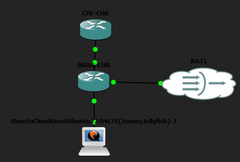
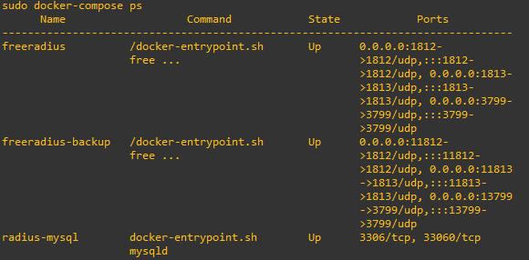
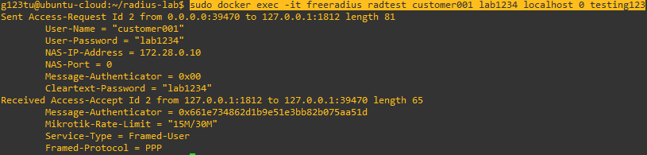
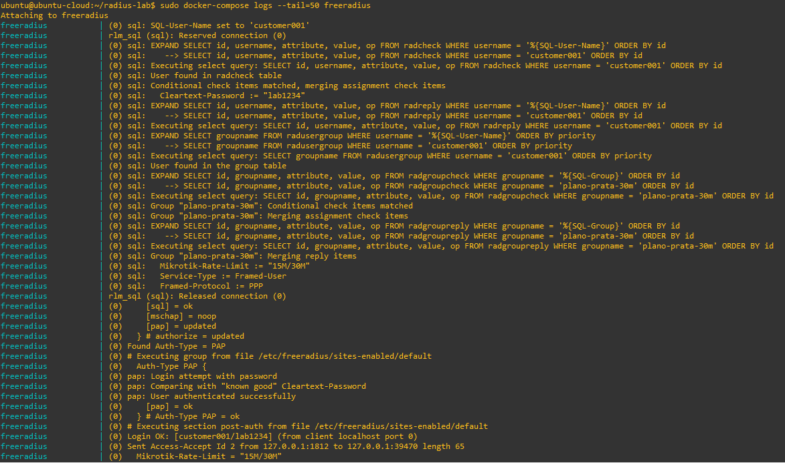
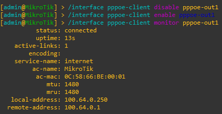
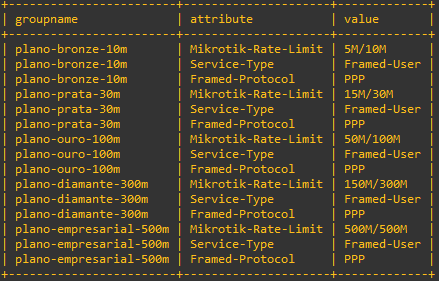
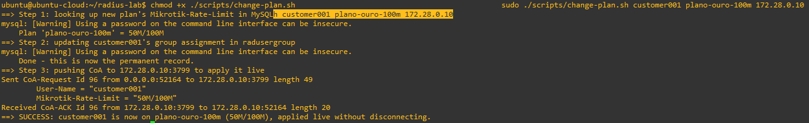
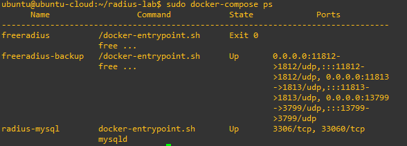

# ISP Lab — Autenticação PPPoE + RADIUS + MySQL

> Implementação completa da stack AAA que provedores de internet reais utilizam em produção: FreeRADIUS com backend MySQL, autenticação PPPoE via MikroTik CHR, troca de plano ao vivo via CoA e failover automático de servidor RADIUS.

---

## O que é este projeto

A maioria dos labs de redes para em "o ping funcionou." Este vai além.

Este projeto constrói o backend completo que um ISP usa para autenticar clientes, atribuir planos de banda, registrar uso e trocar a velocidade de um cliente sem desconectá-lo. Cada componente aqui — FreeRADIUS, MySQL com o schema AAA padrão, PPPoE MikroTik, CoA na porta 3799 — é a mesma stack encontrada em qualquer NOC de provedor real.

Ao final, o sistema permite:
- Um roteador CPE simulado disca via PPPoE e é autenticado contra um banco de dados
- Clientes diferentes recebem velocidades diferentes conforme o plano contratado
- O plano de um cliente pode ser alterado com a sessão ativa, sem desconexão
- Se o servidor RADIUS primário cair, o secundário assume automaticamente

---

## Arquitetura

```
┌──────────────────────────────────────────────────────────────┐
│                         GNS3 (VMware)                        │
│                                                              │
│  ┌─────────────┐   PPPoE / MS-CHAPv2   ┌─────────────────┐  │
│  │   CPE-CHR   │◄─────────────────────►│    BRAS-CHR     │  │
│  │  (cliente)  │                       │ (servidor PPPoE)│  │
│  └─────────────┘                       └────────┬────────┘  │
│                                                 │            │
│                                       RADIUS UDP/1812        │
│                                                 │            │
│                                ┌────────────────▼──────────┐ │
│                                │   Ubuntu 22.04 LTS        │ │
│                                │   192.168.200.135         │ │
│                                │                           │ │
│                                │  ┌──────────────────────┐ │ │
│                                │  │       Docker         │ │ │
│                                │  │  freeradius  :1812   │ │ │
│                                │  │  freeradius  :11812  │ │ │
│                                │  │  mysql       :3306   │ │ │
│                                │  └──────────────────────┘ │ │
│                                └───────────────────────────┘ │
└──────────────────────────────────────────────────────────────┘
```

**Decisão de design:** O FreeRADIUS roda dentro de um nó Ubuntu dentro do próprio GNS3, não no host Windows. Isso elimina os problemas de roteamento UDP assimétrico causados pelas camadas WSL2/Docker/VMware NAT (o pacote de resposta se perde no caminho de volta ao BRAS). Manter tudo dentro do GNS3 garante um caminho de rede limpo e previsível.


*Topologia no GNS3: BRAS-CHR, CPE-CHR e Ubuntu-Server com todas as conexões estabelecidas.*

---

## Pré-requisitos

| Componente | Versão | Notas |
|---|---|---|
| GNS3 | Mais recente | Com GNS3 VM no VMware Workstation |
| MikroTik CHR | 6.49.x | Duas instâncias: BRAS e CPE |
| Ubuntu Cloud Guest | 22.04 LTS | Importado como appliance no GNS3 |
| Docker | 24.x | Instalado dentro do nó Ubuntu |
| docker-compose | v1.x | `sudo apt install docker-compose` |

---

## Estrutura do repositório

```
radius-lab/
├── docker-compose.yml              # Dois servidores FreeRADIUS + MySQL
├── scripts/
│   └── change-plan.sh              # Troca de plano ao vivo via CoA
├── mysql/
│   ├── init/
│   │   ├── 01-schema.sql           # Tabelas AAA padrão do FreeRADIUS
│   │   └── 02-seed-plans.sql       # 5 planos de serviço + clientes de teste
│   └── reports/
│       └── usage-reports.sql       # Consultas de uso para NOC/faturamento
└── freeradius/
    └── raddb/
        ├── radiusd.conf
        ├── clients.conf
        ├── mods-available/
        │   ├── sql                 # Backend MySQL com queries explícitas
        │   ├── mschap              # MS-CHAPv2 (método padrão do RouterOS)
        │   └── expr                # Funções md5/tolower
        ├── mods-enabled/           # Módulos ativos
        ├── mods-config/
        │   └── attr_filter/
        └── sites-available/
            └── default             # Virtual server: auth + accounting + CoA
```

---

## Como reproduzir

### Passo 1 — Topologia no GNS3

Crie um projeto com três nós:
- **BRAS-CHR** (MikroTik CHR) — servidor PPPoE
- **CPE-CHR** (MikroTik CHR) — cliente simulado
- **Ubuntu-Server** (Ubuntu 22.04 Cloud Guest) — roda FreeRADIUS + MySQL

Conexões:
- `CPE-CHR ether1` ↔ `BRAS-CHR ether2` (link PPPoE)
- `BRAS-CHR ether1` ↔ `Ubuntu-Server ens3` (link RADIUS)

O nó Ubuntu recebe IP via DHCP do nó NAT do GNS3 conectado ao `ens3`. Anote o IP — ele será usado em todas as etapas seguintes.

### Passo 2 — Instalar Docker no Ubuntu (dentro do GNS3)

```bash
curl -fsSL https://get.docker.com | sh
sudo usermod -aG docker ubuntu
sudo apt install docker-compose -y
```

### Passo 3 — Clonar e iniciar a stack

```bash
git clone <este-repo>
cd radius-lab

# O FreeRADIUS recusa iniciar se o diretório de config tiver permissões abertas
chmod -R 750 freeradius/raddb

sudo docker-compose up -d
sudo docker-compose ps
```

Todos os três contêineres devem mostrar `Up`.


*Saída de `docker-compose ps` com os três contêineres em estado Up.*

### Passo 4 — Configurar o BRAS (RouterOS)

```routeros
# Pool de IPs para sessões PPPoE
/ip pool add name=pppoe-pool ranges=10.10.10.2-10.10.10.254

# Servidor PPPoE na interface voltada ao cliente
/interface pppoe-server server add \
    interface=ether2 \
    service-name=internet \
    one-session-per-host=yes \
    disabled=no

# Perfil PPP com pool de IPs
/ppp profile set default \
    local-address=10.10.10.1 \
    remote-address=pppoe-pool

# Apontar para o FreeRADIUS (substitua pelo IP real do nó Ubuntu)
/radius add \
    service=ppp \
    address=192.168.200.135 \
    secret=lab-radius-secret-2026 \
    authentication-port=1812 \
    accounting-port=1813 \
    timeout=3s

# RADIUS secundário para failover
/radius add \
    service=ppp \
    address=192.168.200.135 \
    secret=lab-radius-secret-2026 \
    authentication-port=11812 \
    accounting-port=11813 \
    timeout=3s

# Habilitar RADIUS para PPP + CoA incoming
/ppp aaa set use-radius=yes
/radius incoming set accept=yes port=3799
```

### Passo 5 — Configurar o CPE (RouterOS)

```routeros
/interface pppoe-client add \
    name=pppoe-out1 \
    interface=ether1 \
    user=customer001 \
    password=lab1234 \
    disabled=no
```

### Passo 6 — Testar autenticação

```bash
# De dentro do nó Ubuntu:
sudo docker exec -i freeradius radclient -x 127.0.0.1:1812 auth lab-radius-secret-2026 <<EOF
User-Name = customer001
User-Password = lab1234
EOF
```

Resposta esperada:
```
Received Access-Accept
    Mikrotik-Rate-Limit = "15M/30M"
    Service-Type = Framed-User
    Framed-Protocol = PPP
```

Verifique no CPE:
```routeros
/interface pppoe-client monitor pppoe-out1
# Esperado: status: connected
```


*Saída do `radclient` recebendo Access-Accept com o atributo Mikrotik-Rate-Limit aplicado.*


*Log de debug do FreeRADIUS (-X) mostrando o ciclo completo de autenticação: authorize → authenticate → Access-Accept.*


*Monitor da interface PPPoE no CPE-CHR mostrando status: connected após autenticação via RADIUS.*

---

## Planos de serviço

Os planos são armazenados como grupos no MySQL — o padrão usado em produção. Define-se o plano uma vez e atribui-se qualquer número de clientes a ele. Alterar a velocidade de um plano atualiza todos os clientes associados.

```sql
-- Exemplo: mudar o plano Ouro de 100M para 150M para todos os clientes
UPDATE radgroupreply
SET value = '75M/150M'
WHERE groupname = 'plano-ouro-100m'
AND attribute = 'Mikrotik-Rate-Limit';
```

| Plano | Download | Upload | Perfil |
|---|---|---|---|
| `plano-bronze-10m` | 10M | 5M | Residencial básico |
| `plano-prata-30m` | 30M | 15M | Residencial intermediário |
| `plano-ouro-100m` | 100M | 50M | Residencial premium |
| `plano-diamante-300m` | 300M | 150M | Alto padrão |
| `plano-empresarial-500m` | 500M | 500M | Empresarial (simétrico) |


*SELECT em radgroupreply mostrando os 5 planos com seus respectivos Mikrotik-Rate-Limit.*

Adicionar um novo cliente são apenas duas inserções SQL — sem editar arquivos de configuração, sem reiniciar o RADIUS:

```sql
INSERT INTO radcheck (username, attribute, op, value)
VALUES ('novocliente', 'Cleartext-Password', ':=', 'senha');

INSERT INTO radusergroup (username, groupname, priority)
VALUES ('novocliente', 'plano-prata-30m', 1);
```

---

## Troca de plano ao vivo (CoA)

O script `change-plan.sh` cuida do fluxo completo de upgrade/downgrade:

```bash
./scripts/change-plan.sh customer001 plano-ouro-100m 192.168.200.135
```

O que o script faz:
1. Busca o `Mikrotik-Rate-Limit` do novo plano em `radgroupreply`
2. Atualiza `radusergroup` no MySQL (registro permanente, sobrevive a reconexões)
3. Envia um `CoA-Request` ao BRAS na porta 3799
4. O BRAS aplica o novo limite de taxa na sessão PPP ativa imediatamente

Verifique no BRAS:
```routeros
/queue simple print
# Esperado: max-limit=50M/100M (se fazendo upgrade para Ouro)
# O uptime da sessão continua — sem desconexão
```


*Script change-plan.sh aplicando upgrade de plano em sessão ativa — fila do BRAS atualizada sem derrubar a conexão.*

---

## Accounting e relatórios de uso

Cada sessão grava em `radacct` (Start, Interim-Update, Stop). Execute as consultas incluídas para responder perguntas reais de ISP:

```bash
# Quanto de dados cada cliente consumiu?
sudo docker exec -i radius-mysql \
    mysql -uradius -pradiuspass-lab-2026 radius \
    < mysql/reports/usage-reports.sql
```

Outras consultas incluídas:
- Quem está online agora (`acctstoptime IS NULL`)
- Top 10 maiores consumidores do dia
- Uso segmentado por plano de serviço
- Sessões encerradas de forma anormal (conexões instáveis)

---

## Failover

Dois contêineres FreeRADIUS rodam em paralelo, lendo do mesmo MySQL. O BRAS tenta a porta 1812 primeiro, depois 11812 se a primeira exceder o timeout.

Para testar:
```bash
# Derrubar o primário
sudo docker stop freeradius

# No CPE, forçar nova conexão
/interface pppoe-client disable pppoe-out1
/interface pppoe-client enable pppoe-out1
/interface pppoe-client monitor pppoe-out1
# Esperado: status: connected (via o secundário na porta 11812)
```


*Primário derrubado — CPE reconecta automaticamente via servidor secundário na porta 11812.*

---

## Problemas reais encontrados durante o build

**O RouterOS usa MS-CHAPv2 por padrão, não PAP.** Quando o CPE conecta via PPPoE, ele envia atributos de challenge/response MS-CHAP, não um `User-Password` simples. O FreeRADIUS precisa do módulo `mschap` habilitado tanto em `authorize{}` quanto em `authenticate{}`, ou você recebe `No Auth-Type found` sem mensagem de erro útil.

**FreeRADIUS 3.2.x exige queries SQL explícitas.** Definir `authcheck_table = "radcheck"` não é suficiente — é preciso escrever `authorize_check_query`, `authorize_reply_query` e as group queries explicitamente. Sem `sql_user_name = "%{User-Name}"`, as queries rodam com username vazio e não retornam nada.

**Arquivos de regra `attr_filter` ficam em `mods-config/attr_filter/`, não em `policy.d/`.** Os dois diretórios usam parsers diferentes. Colocar um arquivo attr_filter em `policy.d/` produz um erro `unexpected token "=*"` que parece ser problema de sintaxe, mas é problema de diretório errado.

**Os blocos `listen{}` precisam de `virtual_server = default` explicitamente.** Sem isso, o FreeRADIUS carrega a configuração `server default {}` mas nunca roteia os pacotes de entrada para ela. Tudo parseia corretamente, o servidor inicia, e cada requisição é rejeitada silenciosamente com `No Auth-Type found`.

**WSL2 com rede em modo espelhado perde pacotes UDP de retorno do GNS3/VMware.** Este foi o problema mais difícil. O FreeRADIUS recebia o Access-Request e enviava um Access-Accept, mas a resposta nunca chegava ao BRAS. A solução foi remover o FreeRADIUS do host Windows e rodá-lo dentro de um nó Ubuntu dentro do próprio GNS3.

---

## Conceitos demonstrados

- **Arquitetura AAA** — como autenticação, autorização e accounting funcionam juntos em uma rede real
- **RADIUS VSA** — atributos vendor-specific (MikroTik-Rate-Limit) para aplicar políticas por sessão
- **RADIUS com backend SQL** — gerenciamento de planos baseado em grupos normalizados, sem flat files
- **CoA (RFC 5176)** — envio de mudanças de política para sessões ativas sem desconectar usuários
- **Metodologia de troubleshooting em camadas** — cada problema acima foi diagnosticado testando uma camada por vez, lendo o erro real do log correto

---

## Ferramentas utilizadas

- GNS3 com GNS3 VM (VMware Workstation)
- MikroTik CHR 6.49.x (RouterOS)
- Ubuntu 22.04 LTS (Cloud Guest no GNS3)
- FreeRADIUS 3.2.x (Docker)
- MySQL 8.x (Docker)
- docker-compose
